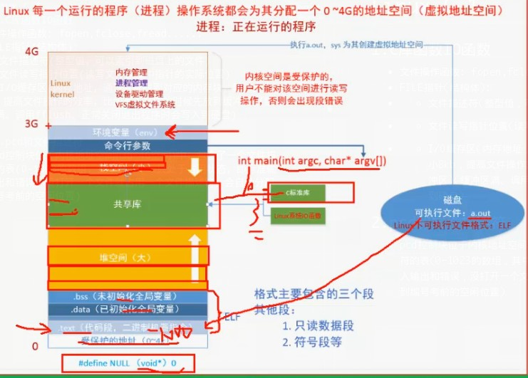
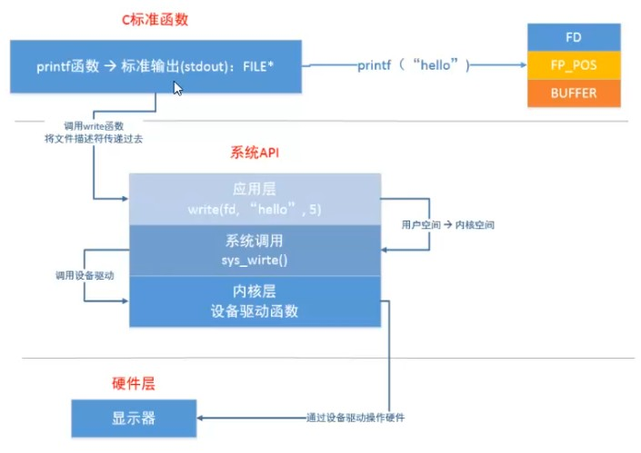
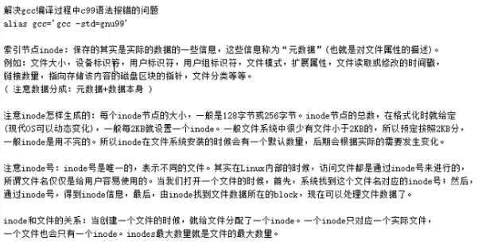
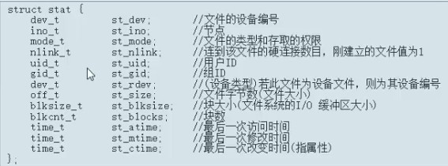
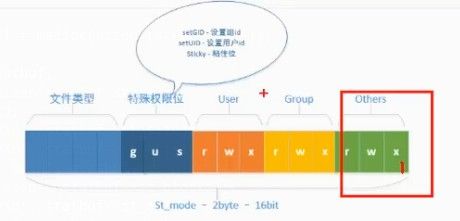
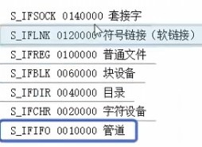
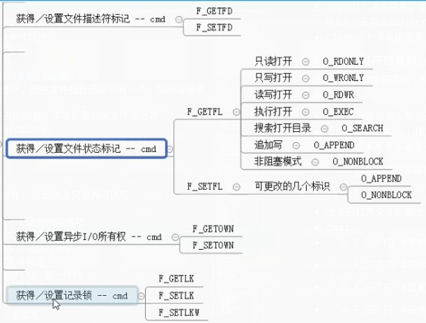

# Linux C 基础系统函数
## *.补充
- 默认文件描述符
- 1. STDIN_FILENO  #默认控制台输入文件描述符
- 2. STDOUT_FILENO  #默认控制台输出文件描述符
- 3. STDERR_FILENO  #默认控制台错误输出文件描述符
- fd转FILE: fdopen函数
- FILE转fd: fileno函数
## 1.C库函数IO函数
- 文件操作函数: fopen,fclose,fread......
- FILE指针(结构体):
- - 文件描述符(整型值，可以索引到磁盘上的文件)
- - 文件读写指针位置(读写文件过程中指针的实际位置)
- - I/O缓存区(内存地址，通过寻址找到对应的内存块，默认大小8kb，提高文件操作的效率，比如写入文件的时候先放到缓冲区)(缓冲区满、调用fflush、正常关闭退出程序时会写入到硬盘)

## 2.pcd和文件描述符
- pcd控制块位于内核地址空间(3G-4G空间)中，包含了一个文件描述符的表(0-1023的数组，其中前三个一只处于占用状态，即标准输入输出和错误，没打开一个文件就占用一个文件描述符，会自动分配到编号考前的空闲位置)

## 3.虚拟地址空间(分配在硬盘上)

> 为什么要引入虚拟地址空间: 
1. 方便编译器和系统安排程序的地址分布
- 程序可以使用相邻的虚拟地址来访问无力内存中不相邻的内存区。
2. 方便程序之间的进程隔离。
- 一个进程中的代码无法更改另一个内存中的代码。
3. 方便系统使用可怜的内存
- 程序可使用一系列虚拟地址来访问大于可用物理内存的内存缓冲区。

### *.库函数与系统函数的关系


## 4.常用的一些系统函数
- open、close、read、write、lseek、stat等，可查看man文档，指定章节2。
### *.errno 错误信息
- 返回的errno错误信息可查看如下文件里的定义和注释:
- - /usr/include/asm-generic/errno-base.h
- - /usr/include/asm-generic/errno.h

### 4.1.open打开或创建文件
- open:
```c
#includ e <sys/types.h>
#include <sys/stat.h>
#include <fcntl.h>

//返回文件描述符，-1表示出错。perror打印会带上错误信息。
int open(const char *pathname, int flags);
int open(const char *pathname, int flags, mode_t mode)
int creat(const char *pathname, mode_t mode);
//注意，mode指定的权限会与"系统本地掩码的反"做位运算与操作
//umask查看本地掩码或者修改。
/*
flags 是模式设置
    O_RDONLY, O_WRONLY, O_RDWR (这三个互斥可与可选模式组合)
    可选模式组合方式: [主模式]|[可选模式]|[可选模式]...
    可选模式:
    O_CREAT, O_APPEND, O_SYNC......
mode 是具体权限(创建文件时), 实质上就是8进制权限码:
S_IRWXU/00700
S_IRWXG/00070
...
*/
```
- close: 
```c
#include <unistd.h>

//返回 0 表示 成功 , 或者 -1 表示 有 错误 发生
int close(int fd);
```

- 例如:
```c
fd = open(fname, O_RDONLY | O_CREAT, 0777);
//如果本地掩码为002则实际权限为0775，相当于(^002)&0777
```
### 4.2.read和write
```c
#include <unistd.h>

ssize_t read(int fd, void *buf, size_t count);
/*
返回: 
-1  : 读取失败
0   : 读取完了
>0  : 读取字节数
*/

#include <unistd.h>

ssize_t write(int fd, const void *buf, size_t count);
```

### 4.3.lseek
```c
#include <sys/types.h>
#include <unistd.h>

//移动或获取文件移动位置指针
off_t lseek(int fd, off_t offset, int whence);
/*
whence取值
SEEK_SET: 相对于起始位置偏移
SEEK_CUR: 相对于当前位置偏移
SEEK_END: 相对于末尾位置偏移
*/
```
- lseek 可以获取文件长度(结束指针位置)，设置读取指针位置，拓展文件。
- lseek拓展文件:
- 1. 从文件末尾偏移所需大小x的位置。
- 2. 写入任意字符。
- 3. 所得拓展的空洞文件大小为原大小+x+1

### 4.4.Linux文件操作相关函数
- stat
- lstat
- access    #测试指定文件是否拥有某种权限，或者是否存在
- chmod #更改文件权限
- chown #更改文件所有者
- truncate  #更改文件大小，大于原大小则增加， 小于则截断
- 链接函数: 
- - link    #创建硬链接
- - symlink #创建软链接
- - readlink    #获取软链接对应文件名
- - unlink  #删除文件并减少链接数，如果是硬链接则删除再硬链接数减1， 需要**写和执行**权限
> 如果硬链接数为0,会释放真实文件数据块和inode， 但如果文件以打开，并持有文件描述符，则等**进程关闭时才会真正删除文件**
> 
> 利用这种特性先创建打开，然后马上删除，达到临时文件的效果。
- rename    #重命名(包括路径)，stdio.h

### *.关于inode
- 目录存在dentry里边(目录项，路径-inode编号)，硬链接实质上就是创建的指向同一个inode的目录项


### stat
```c
#include <sys/types.h>
#include <sys/stat.h>
#include <unistd.h>

int stat(const char *pathname, struct stat *statbuf);
int fstat(int fd, struct stat *statbuf);
int lstat(const char *pathname, struct stat *statbuf);

#include <fcntl.h>           /* Definition of AT_* constants */
#include <sys/stat.h>

int fstatat(int dirfd, const char *pathname, struct stat *statbuf,
        int flags);
```

- - 文件权限: 04读;02写;01执行
- - 特殊权限位: 04设置用户id;02设置组id;01设置粘着位
- mode:

- - *粘着位: 作用是程序运行时不会被放到交换分区中。
- - mode首位，文件类型(掩码: 0170000):

```c
//掩码:
//其他人权限
#define OR_MODE 04  //其他人读
#define OW_MODE 02  //其他人写
#define OX_MODE 01  //其他人执行
#define O_MODE 07   //其他人全
//组用户权限
#define GR_MODE 040 //组用户读
#define GW_MODE 020 //组用户写
#define GX_MODE 010 //组用户执行
#define G_MODE 070  //组用户全
//所有者权限
#define UR_MODE 0400    //所有者读
#define UW_MODE 0200    //所有者写
#define UX_MODE 0100    //所有者执行
#define U_MODE 0700 //所有者全
//特殊权限
#define SU_MODE 04000   //设置用户ID
#define SG_MODE 02000   //设置组ID
#define SS_MODE 01000   //粘着位
#define S_MODE 07000    //特殊权限全
//文件类型
#define TS_MODE 0140000 //套接字类型
#define TL_MODE 0120000 //软链接类型
#define TR_MODE 0100000 //普通文件类型
#define TB_MODE 0060000 //块设备类型
#define TD_MODE 0040000 //目录类型
#define TC_MODE 0020000 //字符设备类型
#define TI_MODE 0010000 //管道类型
#define TYPE_MODE 0170000   //文件类型掩码
```

> 补充: 
> 
> getpwuid: 获取所有者信息，结构体中pw_name为所有者名字字符串
>
> getgrgid: 获取所有组信息，结构体中gr_name为所有组名字字符串
> 
> ctime: 获取该时间的时间字符串

### *.stat和lstat
> stat会穿透软链接直接查出对应文件的信息，而lstat不会穿透

### 4.5.目录操作函数
- chdir #切换当前进程目录
- getcwd    #获取当前进程工作目录
- mkdir #创建目录，需要有**执行权限**
- rmdir #删除**空**目录
- opendir   #打开目录，错误返回NULL，正常返回DIR结构体(包含目录信息)
- readdir   #读目录，读取目录下所有文件包括.和..，结束时返回NULL，正常返回dirent结构体
- closedir  #关闭目录

### 4.6.文件描述符的复制(dup和dup2)
> 虽然有两个文件描述符，但是文件指针还是只有一个，同时写依然是在尾部添加。
- dup   #返回没被占用的最小序号位置新的文件描述符
- dup2  #两个参数old和new，
- - 如果两个不是同一个描述符，会先关闭new再复制
- - 如果不同则直接复制

### 4.7.fcntl
- 改变已打开文件的属性: 比如修改只读为可读写
- cmd:
- - F_DUPFD #复制一个现有的描述符
- - F_GETFD #获得文件描述符标记
- - F_SETFD #设置文件描述符标记
- - F_GETFL #获得文件标记
- - - 和打开文件时的FLAGS是一样的
- - F_SETFL #设置文件标记
- - - 可更改的标识:
- - 1. O_APPEND #追加写
- - 2. O_NONBLOCK   #为阻塞式
- - F_GETOWN    #获得异步I/O所有权
- - F_SETOWN    #设置异步I/O所有权
- - F_GETLK #获得记录锁
- - F_SETLK #设置记录锁
- - F_SETLKW    #设置记录锁



```c
#include <unistd.h>
#include <fcntl.h>

int fcntl(int fd, int cmd, ... /* arg */ );
//相当于如下
int fcntl(int fd, int cmd);
int fcntl(int fd, int cmd, int arg);
int fcntl(int fd, int cmd, struct flock *lock);
```
### 4.8.获取设置环境变量
- getenv
- setenv