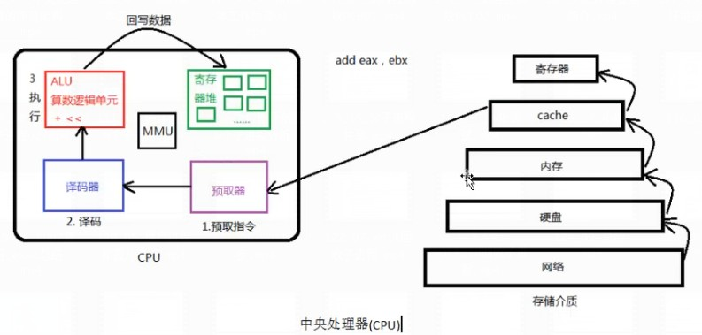
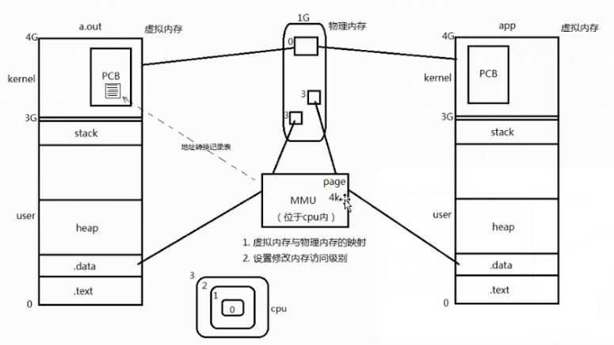
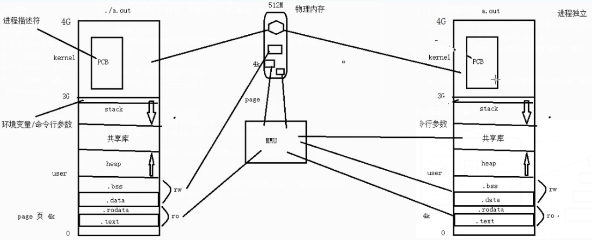
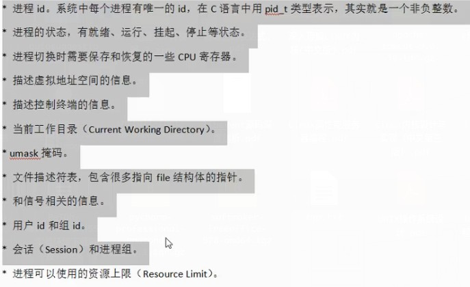
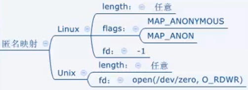

# Linux C 进程线程
## 1.基本概念
### 1.1.程序和进程
- 程序: 一个可执行文件，不占用系统资源(cpu，内存。。。)
- 进程: 抽象概念，占用系统资源
- 程序相当于剧本，进程相当于戏(舞台、演员、灯光。。。)

### 1.2.并行
- 来回进行进程间切换达到看似并行的效果(通过硬件手段时钟中断实现)

### *.程序执行整个过程


### 1.3.mmu

- 将虚拟内存地址与物理内存地址关联起来。
- 设置内存访问级别。(0-3级别，intel)

> mmu在物理内存上的分配单位是page，也就是4k，即便只需要1k依然分配4k
> 
> 不同进程程序用户区内存不会是同一块物理内存，但是**内核区都是同一块内存**，但是**PCB不一样**



### 1.4.PCB进程控制块(进程描述符)
- linux内核的进程控制块是task_struct结构体(sched.h)


### 1.5.环境变量相关
- 获取整个环境变量表:
- - 先声明变量char **enviton
- - 然后循环，当enviton[i]为NULL时截止
```c
#include <stdio.h>

extern char **environ;

int main()
{
    int i;
    for (i = 0; environ[i]; i++)
    {
        printf("%s\n", environ[i]);
    }
}
```

- getenv    #获取指定名的环境变量
- setenv    #设置环境变量
- unsetenv  #删除指定名环境变量


## 2.进程控制
### 2.1.进程创建
- fork函数创建子进程，
- 1. 返回值大于等于0时表示创建成功，其中，父进程中返回值为大于0的数，子进程中返回值为0
- 2. 返回值为-1时，创建失败
- getpid    #获取当前进程pid
- getppid    #获取父进程pid
- getuid    #获取当前进程实际用户id
- gettuid   #获取当前进程有效用户id
- getgid    #获取当前进程使用用户组id
- getegid   #获取当前进程有效用户组id

> 一定要注意创建子进程后，子进程就会从fork之后开始执行，**注意判断子进程并做不同处理**，比如循环创建子进程的时候，会出现预料之外的个数的子进程
> 
> 若父进程先结束，会出现控制台先回到待输入状态而程序仍在输出的情况

### 2.2.进程共享
- 父子进程共享: 
- 1. 文件描述符(打开文件的结构体)
- 2. mmap建立的映射区(进程间通信详解)
- 父子相同处: 全局变量、.data、.text、堆、栈、环境变量、用户id、宿主目录、进程工作目录、信号处理方式...
- 父子不同处: 进程id、fork返回值、父进程id、进程运行时间、闹钟(定时器)、未决信号集
> 原则: 读时共享，写时复制
> 
> fork父与子谁先执行由内核调度算法决定。

### 2.7.gdb，含子进程的程序
- 默认gdb跟踪父进程
- set follow-fork-mode child    #设置在fork之后跟踪子进程
- set follow-fork-mode parent   #设置跟踪父进程
- 用if设置断点条件为第几个子进程创建前

## 3.exec函数族(加载一个进程)
- 子进程调用exec后，子进程内存所有内容会替换成exec所执行的程序，不再是父进程的副本。进程外壳不变(例如pid)
- 注意arg参数末尾需要加上一个NULL传入参数，不论是否有其他参数
- 第二个参数是argv0, 相当于argv的第一个参数
- - l   #list，命令行参数列表(可变参形式)
- - p   #会在PATH中查找
- - e   #自己指定环境变量
- - v   #argv会以数组方式传入而不是可变参数
```c
#include <unistd.h>

extern char **environ;

int execl( const char *path, const char *arg, ...);
int execlp( const char *file, const char *arg, ...);
int execle( const char *path, const char *arg , ..., char * const envp[]);
int execv( const char *path, char *const argv[]);
int execvp( const char *file, char *const argv[]);

//如: 
execlp("ls", "ls", "-l", "-a", NULL);   //会在PATH中查找
execl("/bin/ls", "ls", "-l", "-a", NULL);   //使用绝对地址，不会查找PATH
```

## 4.进程
### 4.1.孤儿进程和僵尸进程，wait函数
- 孤儿进程:
- - 父进程比子进程先结束的话，子进程的父进程会变为/sbin/init进程(pid为1)，由init进程进行回收，也就是俗称的进孤儿院。
- 僵尸进程:
- - 子进程结束了但是父进程并未进行回收，PCB中还有残留
- - kill命令无法清除僵尸进程，因为僵尸进程已经挂掉了。

> 僵尸进程在命令行ps的输出中可以看到[名字]\<defunct\>,表示进程已挂掉但未回收。
> 插题话: ps输出的状态列中:R表示运行,S表示后台运行,Z表示僵尸进程

- wait: (一次wait只能回收一个子进程，先结束的子进程)(返回-1表示没有子进程)
- 1. 阻塞等待子进程结束
- 2. 回收子进程残留资源
- 3. 获取子进程结束状态
- - WIFEXITED   #非0时表示正常结束
- - WEXITSTATUS #WIFEXITED为真时此宏为子进程结束返回值
- - WIFSIGNALED #非0时表示异常终止
- - WTERMSIG    #若上宏为真，此宏获得使进程终止的信号编号  ，比如kill命令的第二个参数(可kill -l查看有哪些信号)
- - WCOREDUMP   
- - WIFSTOPPED  #非0时表示进程处于暂停状态
- - WSTOPSIG    #若上宏为真，此宏获取使进程暂停的信号编号
- - WIFCONTINUED    #为真时表示进程暂停后已经继续运行
- waitpid
- 1. 作用同于wait
- 2. 可以清理指定pid进程
- 3. 可以不阻塞(不阻塞时，返回0表示没有回收，子进程正在运行)
```c
#include <sys/types.h>
#include <sys/wait.h>
/*
pid > 0 回收指定进程
=-1 回收任意进程(相当于wait)
=0  回收和当前调用waitpid一个组的所有子进程
<-1 回收指定进程组内的任意子进程

option
WNOHANG 非阻塞
WNOHANG     return immediately if no child has exited.

WUNTRACED   also return if a child has stopped (but not traced via ptrace(2)).   Status  for  traced  children which have stopped is provided even if this option is not specified.

WCONTINUED (since Linux 2.6.10) also return if a stopped child has been resumed by delivery of SIGCONT.
*/
pid_t waitpid(pid_t pid, int *wstatus, int options);
```

### 4.2.IPC进程间通信
1. 管道(最简单)
- pipe(管道一般读写行为)
- fifo(非血缘关系进程间通信)
2. 信号(开销最小)
3. 共享映射区(无血缘关系)
- mmap(非血缘关系进程间通信)
4. 本地套接字(最稳定)

#### 4.2.1.管道(匿名管道)
1. 其本质是一个伪文件(实为内核缓冲区，队列)
2. 由两个文件描述符引用，一个读一个写
3. 规定从写端流入，读端流出
- 局限性
1. 不能自己读自己写
2. 数据一旦被读走就不存在了，不可反复读取
3. 半双工通信方式，数据只能在一个方向上流动
4. 只能在有公共祖先的进程间使用
```c
#include <unistd.h>

/* On Alpha, IA-64, MIPS, SuperH, and SPARC/SPARC64; see NOTES */
struct fd_pair {
    long fd[2];
};
struct fd_pair pipe();

/* On all other architectures */
int pipe(int pipefd[2]);

#define _GNU_SOURCE             /* See feature_test_macros(7) */
#include <fcntl.h>              /* Obtain O_* constant definitions */
#include <unistd.h>

int pipe2(int pipefd[2], int flags);

//正常0, 异常-1
//数组中0为可读的，1为可写的
```

#### 4.2.2.fifo非血缘管道(命名管道)
- 可以同时多端读多端写
```c
#include <sys/types.h>
#include <sys/stat.h>

int mkfifo(const char *pathname, mode_t mode);

/* Definition of AT_* constants */
#include <fcntl.h>  
#include <sys/stat.h>

int mkfifoat(int dirfd, const char *pathname, mode_t mode);

//然后用open打开即可
```

#### 4.2.3.mmap共享内存映射
1. 创建映射区过程中隐含了一次文件读取操作，所以需要读取权限
2. 映射区权限需要小于或者等于文件权限，标志无所谓
3. 文件关闭对已创建的映射区无影响，映射区创建后即可关闭文件
4. 映射区大小不能为0，所以用于映射的文件必须有实际大小，mmap总线错误一般都是共享文件储存大小引起的
5. munmap传入的指针地址一定是mmap返回的地址
6. 文件偏移量必须是4K的整数倍，因为一页就相当于4K
7. mmap出错概率很高，需要仔细检查返回值
8. 利用mmap进行父子通信时，MAP_SHARED可以正常工作，MAP_PRICATE则不行，相当于映射区私有不共享。
```c
#include <sys/mman.h>

void *mmap(void *addr, size_t length, int prot,    int flags, int fd, off_t offset);
int munmap(void *addr, size_t length);  //关闭映射区
/*
若addr为NULL，则内核自动分配
prot为权限，读，写，执行
flags设置映射区修改是否反映到物理磁盘上
    MAP_SHARED  #会反映到物理磁盘上 
    MAP_PRIVATE #不会反映到无力磁盘上
offset文件的偏移量(4K的整数倍)
返回值:
成功: 返回创建映射区的首地址
失败: 返回MAP_FAILED宏

详情查看man文档
*/
```

#### 4.2.4.mmap匿名映射区
- 使用宏MAP_ANONYMOUS(或MAP_ANON)
```c
//大小随意
int *p = mmap(NULL,4,PROT_READ|PROT_WRITE,MAP_SHARED|MAP_ANONYMOUS,-1,0);
```


#### 4.2.5.mmap非血缘进程通信
- mmap指向同一个文件，并且shared即可
- 可多端读多端写

#### 4.2.6.用文件进行进程间通信
- 同理

### 5.信号
#### 5.1.信号基本概念
- 简单  #只能带一个简单标志
- 不占内存  #用或不用信号都是一样内存占用
- 信号是由软件方式实现的(软中断)，所以其具有很强的延时性，但对于用户来说不易察觉
- **每个进程收到的信号都是由内核负责发送的，内核处理**
- 