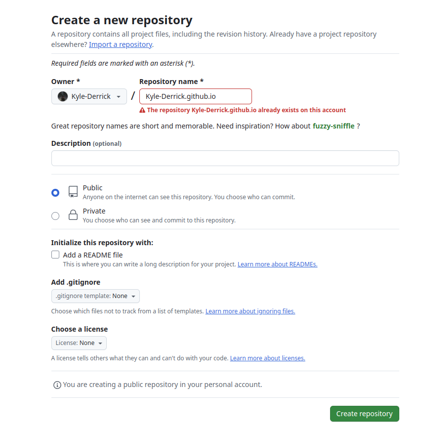
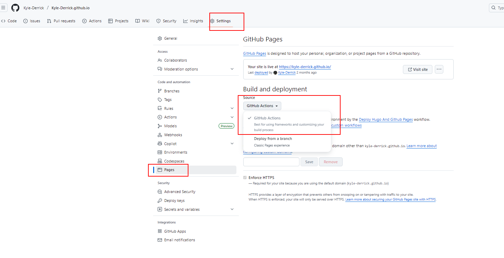

# 1. Hugo部分
## 1.1. 安装Hugo
> https://github.com/gohugoio/hugo/releases/latest

根据自己的操作系统下载 hugo_extended_withdeploy_xxx，我这里是Ubuntu，所以下载的 hugo_extended_withdeploy_0.147.3_linux-amd64.deb

## 1.2. Hugo创建站点（项目）
> Hugo 默认配置文件格式是.toml，但.yml格式更易看懂，更好配置，所以我这里使用的yml格式配置文件
```shell
hugo new site Kyle-Derrick.github.io -f yml
```

完事后生成一个Kyle-Derrick.github.io目录，进入目录后是如下结构：
```tree
Kyle-Derrick.github.io/
├── archetypes/
│   └── default.md
├── assets/
├── content/
├── data/
├── i18n/
├── layouts/
├── static/
├── themes/
└── hugo.yml         <-- site configuration
```

目录说明：

文件名称    | 简要说明
---|-----
archetypes  | 该文件夹主要用来存储博客生成的模板文件，初次使用只有一个default.md，可以根据个人的主题配置添加自定义头部信息
assets  | 该文件夹主要用于保存博客样式css和js文件
content | 保存个人博客所有内容
data    | 保存生成站点时候所需要的配置文件
layouts | 以为.html形式存储模板，将你博客内容呈现为静态页面
static  | 存储所有静态内容：图片、.css、.js等，当使用 Hugo 生成静态页面时，所有内容将会被复制
resources   | 缓存一些文件来加速站点生成
themes  | 保存主题
config.yml  | 个人博客主题样式配置文件

## 1.3. 编辑 config.yml 文件
可以参考官方的进行修改：https://github.com/adityatelange/hugo-PaperMod/wiki/Installation#sample-hugoyml

我这里根据网上找的案例然后简单改了改：
> 注意里边的 ```publishDir: "docs"``` 后边Github Pages时有用
```yml
baseURL: https://Kyle-Derrick.github.io # 绑定的域名
title: Kyle's Notebook
publishDir: "docs"
# paginate: 10    # 首页每页显示的文章数
theme: PaperMod # 主题名称，和themes文件夹下的一致
languageCode: zh-cn # en-us # 网站默认语言为简体中文
pagination:
    pagerSize: 10  # 控制每页显示数量
    path: "page/"  # 可选：分页路径格式

hasCJKLanguage: true # 自动检测是否包含中文日文韩文,如果文章中使用了很多中文引号的话可以开启（解决中文引号排版问题）
enableInlineShortcodes: true  # 允许行内短代码
enableEmoji: true # 允许使用 Emoji 表情，建议 true
enableRobotsTXT: true     # 生成 robots.txt 文件
buildDrafts: false        # 不构建草稿文章
buildFuture: false        # 不构建未来日期的文章
buildExpired: false       # 不构建已过期的文章
pygmentsUseClasses: true   # 使用 CSS 类而非内联样式（代码高亮）
# googleAnalytics: UA-123-45


minify:
    disableXML: true  # 禁用 XML 压缩
    # minifyOutput: true

permalinks:
  post: "/:title/"
  # post: "/:year/:month/:day/:title/"

defaultContentLanguage: zh # 最顶部首先展示的语言页面
defaultContentLanguageInSubdir: true  # 每种语言生成独立子目录（如 /zh/）

languages:
    zh:
      languageName: "Chinese" # 显示在语言切换器中的名称
      # contentDir: content/english
      weight: 1 # 权重最高（默认语言）

outputs:
    home:
        - HTML
        - RSS             # 生成 RSS 订阅源
        - JSON            # 生成 JSON Feed


menu:
  main:
    - identifier: search
      name: 搜索
      url: search
      weight: 1
    - identifier: home
      name: 主页
      url: /
      weight: 2
    - identifier: posts
      name: 文章
      url: /posts
      weight: 3
    - identifier: archives
      name: 时间轴
      url: archives
      weight: 20
    # - identifier: categories
    #   name: 🧩分类
    #   url: categories
    #   weight: 30
    - identifier: tags
      name: 标签
      url: /tags
      weight: 40
    - identifier: about
      name: 关于
      url: /about
      weight: 50
    # - identifier: links
    #   name: 🤝友链
    #   url: links
    #   weight: 60

params:
    env: production # to enable google analytics, opengraph, twitter-cards and schema.
    description: "这是一个纯粹的博客......"
    author: Shaohan Tian
    author: "Me"
    # author: ["Me", "You"] # multiple authors


    defaultTheme: auto  # 自动切换深色/浅色模式
    disableThemeToggle: false # 允许用户手动切换主题
    DateFormat: "2006-01-02"
    ShowShareButtons: true
    ShowReadingTime: true
    # disableSpecialistPost: true
    displayFullLangName: true
    ShowPostNavLinks: true
    ShowBreadCrumbs: true
    ShowCodeCopyButtons: true # 显示代码复制按钮
    hideFooter: false # 隐藏页脚
    ShowWordCounts: true
    VisitCount: true

    ShowLastMod: true #显示文章更新时间

    ShowToc: true # 显示目录
    TocOpen: true # 自动展开目录

    comments: true


    # 个人资料模块配置
    profileMode:
      enabled: true
      title: 平平无奇的记忆碎片收纳墙  # 个人简介标题
      subtitle: "欢迎光临寒舍"  # 带 HTML 格式的副标题
      # imageUrl: "img/logo.gif"      # 头像图片路径
      # imageTitle:
      # imageWidth: 150
      # imageHeight: 150
      buttons:                      # 导航按钮
        - name: 技术
          url: posts/tech
        - name: 阅读
          url: posts/read
        - name: 生活
          url: posts/life

    socialIcons:  # 社交图标链接
        - name: github
          url: "https://github.com/Kyle-Derrick"
        # - name: twitter
        #   url:  "img/twitter.png"
        # - name: bilibili
        #   url: "https://space.bilibili.com/395280439"
        # - name: QQ
        #   url: "img/qq.jpg"
        # - name: email
        #   url: "mailto:shaohan.tian@foxmail.com"
        - name: RSS
          url: "index.xml"
        # - name: facebook
        #   url: "https://www.facebook.com/profile.php?id=100027782410997"
        # - name: instagram
        #   url: "img/instagram.png"
        # - name: QQ
        #   url: "img/qq.png"
        # - name: Phone
        #   url: "img/phone.png"


    # editPost:
    #     URL: "https://github.com/adityatelange/hugo-PaperMod/tree/exampleSite/content"
    #     Text: "Suggest Changes" # edit text
    #     appendFilePath: true # to append file path to Edit link

    # label:
    #     text: "Home"
    #     icon: icon.png
    #     iconHeight: 35

    # analytics:
    #     google:
    #         SiteVerificationTag: "XYZabc"

    assets:
        favicon: "img/favicon.ico"
        favicon16x16: "img/favicon-16x16.ico"
        favicon32x32: "img/favicon-32x32.ico"
        apple_touch_icon: "img/apple-touch-icon.png"
        safari_pinned_tab: "img/favicon.ico"

    # cover:
    #     hidden: true # hide everywhere but not in structured data
    #     hiddenInList: true # hide on list pages and home
    #     hiddenInSingle: true # hide on single page

    fuseOpts: # 搜索功能配置
        isCaseSensitive: false  # 不区分大小写
        shouldSort: true
        location: 0
        distance: 1000
        threshold: 1            # 搜索敏感度
        minMatchCharLength: 0
        keys: ["title", "permalink", "summary"]

    twikoo:
      version: 1.4.11

taxonomies:
    category: categories  # 分类系统使用 /categories/ 路径
    tag: tags             # 标签系统使用 /tags/ 路径
    series: series        # 系列文章使用 /series/ 路径

markup:
    goldmark:
        renderer:
            unsafe: true # HUGO 默认转义 Markdown 文件中的 HTML 代码，如需开启的话
    highlight:
        # anchorLineNos: true
        codeFences: true
        guessSyntax: true
        lineNos: true     # 显示行号
        # noClasses: false
        # style: monokai
        style: darcula    # 代码高亮主题为 Darcula

        # codeFences：代码围栏功能，这个功能一般都要设为 true 的，不然很难看，就是干巴巴的-代码文字，没有颜色。
        # guessSyntax：猜测语法，这个功能建议设置为 true, 如果你没有设置要显示的语言则会自动匹配。
        # hl_Lines：高亮的行号，一般这个不设置，因为每个代码块我们可能希望让高亮的地方不一样。
        # lineNoStart：行号从编号几开始，一般从 1 开始。
        # lineNos：是否显示行号，我比较喜欢显示，所以我设置的为 true.
        # lineNumbersInTable：使用表来格式化行号和代码,而不是 标签。这个属性一般设置为 true.
        # noClasses：使用 class 标签，而不是内嵌的内联样式

privacy:      # 隐私相关设置
    vimeo:
        disabled: false
        simple: true

    x:
        disabled: false
        enableDNT: true
        simple: true

    instagram:
        disabled: false
        simple: true

    youtube:
        disabled: false
        privacyEnhanced: true   # 启用 YouTube 隐私增强模式

services:
    instagram:
        disableInlineCSS: true
    x:
        disableInlineCSS: true

```

## 1.4. 添加搜索页面
添加以下配置到 config.yml 文件（上述配置文件已有，此处不用重复添加）
```yml
outputs:
    home:
        - HTML
        - RSS
        - JSON # is necessary
```
在content文件夹中创建search.md并添加以下配置：
```yml
---
title: "搜索" # in any language you want
layout: "search" # is necessary
summary: "search"
placeholder: "搜索框内的默认显示"
---
```

要使得某些特定的不被搜素到，可以在博客开头添加：

```yml
searchHidden: true
```

## 1.5. 配置时间轴页面
在content文件夹中创建archive.md并添加以下配置：
```yml
---
title: "时间轴"
layout: "archives"
url: "/archives/"
summary: archives
---
```

## 1.6. 配置标签页面

### 1.6.1 修改默认翻译
在项目根目录新建i18n/文件夹，复制themes/PaperMod/i18n/zh.yaml到i18n/zh.yaml

### 1.6.2 修改 html 模板
标签页对应的模板文件为themes/PaperMod/layouts/_default/terms.html，同以上步骤：在网站根目录新建layouts/_default/文件夹，复制themes/PaperMod/layouts/_default/terms.html到layouts/_default/terms.html，并编辑（主要添加标签那几行）
```html
{{- define "main" }}

{{- if .Title }}
<header class="page-header">
    <h1>{{ .Title }}</h1>
    {{- if eq .Title "Tags" }}
        <h1>{{ "标签" }}</h1>
        <!-- <h1>{{ .Title }}</h1> -->
    {{- end }}
    {{- if .Description }}
    <div class="post-description">
        {{ .Description }}
    </div>
    {{- end }}
</header>
{{- end }}

<ul class="terms-tags">
    {{- $type := .Type }}
    {{- range $key, $value := .Data.Terms.Alphabetical }}
    {{- $name := .Name }}
    {{- $count := .Count }}
    {{- with site.GetPage (printf "/%s/%s" $type $name) }}
    <li>
        <a href="{{ .Permalink }}">{{ .Name }} <sup><strong><sup>{{ $count }}</sup></strong></sup> </a>
    </li>
    {{- end }}
    {{- end }}
</ul>

{{- end }}{{/* end main */ -}}
```

## 1.7. 配置关于页面
根据定义好的模板，在此利用该模板生成关于页面，根目录执行执行命令：
```shell
hugo new --kind post content/about.md
```

## 1.8. 内容管理
我们写作的内容都是放在content目录下的，因此有必要对其内容有一个基本了解
在官方文档 Content Management 中详尽地介绍了管理博客内容需要了解的所有信息，以下是我的一个目录结构，其中的 about.md、 archive.md 和 search.md 对应博客中的关于、时间轴和搜索：
```tree
content
├── posts
│   ├── _index.md
│   ├── life
│   │   └── _index.md
│   ├── read
│   │   └── _index.md
│   └── tech
│       └── _index.md
├── about.md
├── archive.md
└── search.md
```
以上目录结构看到出现了很多_index.md,官方参考文档在此Index Pages 。简而言之，这个文件是作为自定义索引页存在。这里给出我使用的一个_index.md作为参考：
```md
---
title: "文章"
# description: "文章。"
hidemeta: true # 是否隐藏文章的元信息，如发布日期、作者等
---

杂七杂八的文章。
<!-- more -->
```
注意：根据个人博客具体分类将其生成到对应路径。

# 2. Github Pages部分

## 2.1. 新建Github仓库
> 注意仓库名一定是 用户名.github.io 的形式



## 2.2. 新增Github Actions

在hugo根目录新增 ```.github\workflows\deploy-hugo-and-pages.yml```

```yaml
# Simple workflow for deploying static content to GitHub Pages
name: Deploy Hugo And Github Pages

on:
  # Runs on pushes targeting the default branch
  push:
    branches: ["master"]

  # Allows you to run this workflow manually from the Actions tab
  workflow_dispatch:

# Sets permissions of the GITHUB_TOKEN to allow deployment to GitHub Pages
permissions:
  contents: write
  pages: write
  id-token: write

# Allow only one concurrent deployment, skipping runs queued between the run in-progress and latest queued.
# However, do NOT cancel in-progress runs as we want to allow these production deployments to complete.
concurrency:
  group: "pages"
  cancel-in-progress: false

jobs:
  # Single deploy job since we're just deploying
  deploy:
    environment:
      name: github-pages
      url: ${{ steps.deployment.outputs.page_url }}
    runs-on: ubuntu-latest
    steps:
      - name: Checkout
        uses: actions/checkout@v4
        with:
            submodules: true
            fetch-depth: 0
            persist-credentials: true

      - name: Setup Hugo
        uses: peaceiris/actions-hugo@v2
        with:
            hugo-version: "latest"
            
      - name: Build Web
        run: hugo --gc --minify --cleanDestinationDir

      - name: Commit artifacts
        run: |
          git config --global user.name "GitHub Actions Bot"
          git config --global user.email "github-actions@example.com"
          git add ./docs
          git commit -m "chore: Auto-commit build artifacts [skip ci]" || echo "No changes to commit"
          git push origin HEAD:master
        env:
          GITHUB_TOKEN: ${{ secrets.GITHUB_TOKEN }}
      # - name: Checkout
      #   uses: actions/checkout@v4
      - name: Setup Pages
        uses: actions/configure-pages@v5
      - name: Upload artifact
        uses: actions/upload-pages-artifact@v3
        with:
          # Upload entire repository
          path: './docs'
      - name: Deploy to GitHub Pages
        id: deployment
        uses: actions/deploy-pages@v4
```

## 2.3. 配置GitHub Pages设置
> 配置 Build and deployment 下的 Source 为 GitHub Actions



> 完成