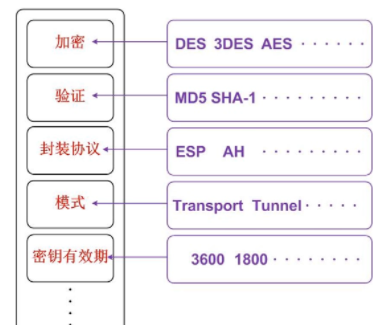
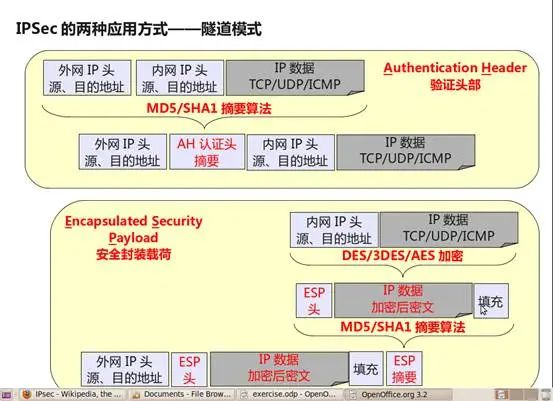
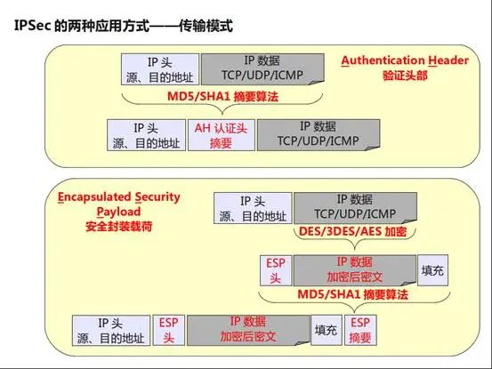
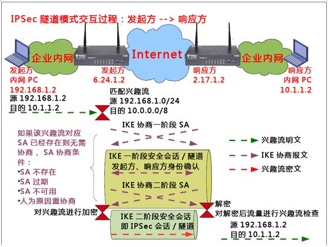
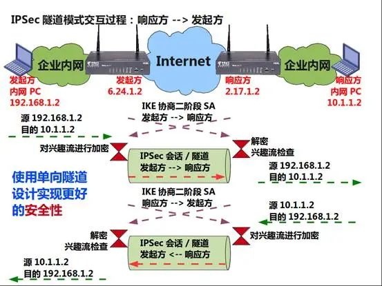

**什么是IPSec**

IPSec（Internet Protocol Security）是IETF（Internet Engineering Task Force）制定的一组开放的[网络安全](https://cloud.tencent.com/product/ns?from_column=20065&from=20065)协议。它并不是一个单独的协议，而是一系列为IP网络提供安全性的协议和服务的集合。

IPSec用来解决IP层安全性问题的技术。IPSec被设计为同时支持IPv4和IPv6网络。主要通过加密与验证等方式，为IP数据包提供安全服务。

**IPSec提供的服务?**

数据来源验证：接收方验证发送方身份是否合法。

[数据加密](https://cloud.tencent.com/solution/domesticencryption?from_column=20065&from=20065)：发送方对数据进行加密，以密文的形式在Internet上传送，接收方对接收的加密数据进行解密后处理或直接转发。

数据完整性：接收方对接收的数据进行验证，以判定报文是否被篡改。

抗重放：接收方拒绝旧的或重复的数据包，防止恶意用户通过重复发送捕获到的数据包所进行的攻击。

**IPSec** [**VPN**](https://cloud.tencent.com/product/vpn?from_column=20065&from=20065)**的应用场景分为3种**：

1. Site-to-Site（站点到站点或者网关到网关）：如弯曲评论的3个机构分布在互联网的3个不同的地方，各使用一个商务领航网关相互建立VPN隧道，企业内网（若干PC）之间的数据通过这些网关建立的IPSec隧道实现安全互联。

2. End-to-End（端到端或者PC到PC）： 两个PC之间的通信由两个PC之间的IPSec会话保护，而不是网关。

3. End-to-Site（端到站点或者PC到网关）：两个PC之间的通信由网关和异地PC之间的IPSec进行保护。

**VPN只是IPSec的一种应用方式:**

IPSec其实是IP Security的简称，它的目的是为IP提供高安全性特性，VPN则是在实现这种安全特性的方式下产生的解决方案。IPSec是一个框架性架构，具体由两类协议组成：

1. AH协议（Authentication Header，使用较少）：可以同时提供数据完整性确认、数据来源确认、防重放等安全特性；AH常用摘要算法（单向Hash函数）MD5和SHA1实现该特性。

2. ESP协议（Encapsulated Security Payload，使用较广）：可以同时提供数据完整性确认、数据加密、防重放等安全特性；ESP通常使用DES、3DES、AES等加密算法实现数据加密，使用MD5或SHA1来实现数据完整性。

**IPSec封装模式:**

**可以发现传输模式和隧道模式的区别：**

1. 传输模式在AH、ESP处理前后IP头部保持不变，主要用于End-to-End的应用场景。

2. 隧道模式则在AH、ESP处理之后再封装了一个外网IP头，主要用于Site-to-Site的应用场景。

总的来说就是：

- **隧道模式**：加密整个 IP 数据包，通常用于站点到站点 VPN，因为需要在两个不同的网络之间建立一个完全加密的通道。该模式封装并加密整个 IP 包，然后附加一个新的外部 IP 头部进行传输。
  
- **传输模式**：仅加密 IP 数据包的负载部分（即实际数据），保留原始的 IP 头部。通常用于主机到主机或客户端到服务器的连接，适用于远程访问 VPN。

**IPSec除了一些协议原理外，我们更关注的是协议中涉及到方案制定的内容：**

1. 兴趣流：IPSec是需要消耗资源的保护措施，并非所有流量都需要IPSec进行处理，而需要IPSec进行保护的流量就称为兴趣流，最后协商出来的兴趣流是由发起方和响应方所指定兴趣流的交集，如发起方指定兴趣流为192.168.1.0/24 -> 10.0.0.0/8，而响应方的兴趣流为10.0.0.0/8 -> 192.168.0.0/16，那么其协商结果是192.168.1.0/24 <-> 10.0.0.0/8，这就是最后会被IPSec所保护的兴趣流。

2. 发起方：Initiator，IPSec会话协商的触发方，IPSec会话通常是由指定兴趣流触发协商，触发的过程通常是将数据包中的源、目的地址、协议以及源、目的端口号与提前指定的IPSec兴趣流匹配模板如ACL进行匹配，如果匹配成功则属于指定兴趣流。指定兴趣流只是用于触发协商，至于是否会被IPSec保护要看是否匹配协商兴趣流，但是在通常实施方案过程中，通常会设计成发起方指定兴趣流属于协商兴趣流。

3. 响应方：Responder，IPSec会话协商的接收方，响应方是被动协商，响应方可以指定兴趣流，也可以不指定（完全由发起方指定）。

4. 发起方和响应方协商的内容主要包括：双方身份的确认和密钥种子刷新周期、AH/ESP的组合方式及各自使用的算法，还包括兴趣流、封装模式等。

5. SA：发起方、响应方协商的结果就是曝光率很高的SA，SA通常是包括密钥及密钥生存期、算法、封装模式、发起方、响应方地址、兴趣流等内容。

**上图描述了由兴趣流触发的IPSec协商流程，**原生IPSec并无身份确认等协商过程，在方案上存在诸多缺陷，如无法支持发起方地址动态变化情况下的身份确认、密钥动态更新等。伴随IPSec出现的IKE（Internet Key Exchange）协议专门用来弥补这些不足：

1. 发起方定义的兴趣流是源192.168.1.0/24目的10.0.0.0/8，所以在接口发送发起方内网PC发给响应方内网PC的数据包，能够得以匹配。

2. 满足兴趣流条件，在转发接口上检查SA不存在、过期或不可用，都会进行协商，否则使用当前SA对数据包进行处理。

3. 协商的过程通常分为两个阶段，第一阶段是为第二阶段服务，第二阶段是真正的为兴趣流服务的SA，两个阶段协商的侧重有所不同，第一阶段主要确认双方身份的正确性，第二阶段则是为兴趣流创建一个指定的安全套件，其最显著的结果就是第二阶段中的兴趣流在会话中是密文。

**IPSec中安全性还体现在第二阶段SA永远是单向的：**

从上图可以发现，在协商第二阶段SA时，SA是分方向性的，发起方到响应方所用SA和响应放到发起方SA是单独协商的，这样做的好处在于即使某个方向的SA被破解并不会波及到另一个方向的SA。这种设计类似于双向车道设计。

IPSec虽然只是5个字母的排列组合，但其所涉及的协议功能众多、方案又极其灵活，本期主要介绍IPSec的基本原理，在后续专栏还会继续介绍IPSec的其它方面知识
