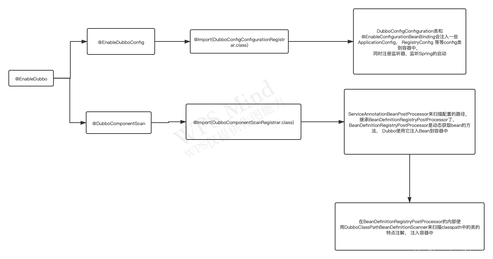

## @EnableDubbo
@EnableDubbo中包含@EnableDubboConfig和@DubboComponentScan，也是这两个注解实际上在生效


## Service注册：


### 扫描
ServiceAnnotationPostProcessor
* postProcessBeanDefinitionRegistry 
> 扫描指定的包路径，注册beanDefinition，并注册ServiceBean的对应beanDefinition
* postProcessBeanFactory
> 主要处理是通过@Bean注入的Service

### 还可以通过手动注入ServiceBean实现


## Reference注册：

### 旧版 Reference
> 这里 @Reference 发现主要借助于，postProcessMergedBeanDefinition方法在Bean创建之前合并定义的时候进行判断该类中是否有指定注解，如果有则持有其反射对象，待后面通过 postProcessPropertyValues 统一处理 （这种方式，在spring中与使用@Value注解流程一致）。

ReferenceAnnotationBeanPostProcessor
* registerReferenceBean

**对于静态成员变量dubbo是不会进行处理的**
```java
    private List<AbstractAnnotationBeanPostProcessor.AnnotatedFieldElement> findFieldAnnotationMetadata(final Class<?> beanClass) {
		...
		 if (Modifier.isStatic(field.getModifiers())) {
			 if (logger.isWarnEnabled()) {
				logger.warn("@" + annotationType.getName() + " is not supported on static fields: " + field);
			}
		 	return;
		 }
		...
    }
```
> 如果需要设置为静态成员变量，只能通过访问方法，然后在其中设置，注意：这种使用方式，将会使你RPC通信内部的信息共享，导致不可预见的问题，请避免使用。

** postProcessPropertyValues的处理流程**
```java
 @Override
    public PropertyValues postProcessPropertyValues(
            PropertyValues pvs, PropertyDescriptor[] pds, Object bean, String beanName) throws BeansException {

        try {
            //第一步，从容器中获取反射对象，如果没有，则重复发现步骤
            AnnotatedInjectionMetadata metadata = findInjectionMetadata(beanName, bean.getClass(), pvs);
            prepareInjection(metadata);
            //第二步进行注入
            metadata.inject(bean, beanName, pvs);
        } catch (BeansException ex) {
            throw ex;
        } catch (Throwable ex) {
            throw new BeanCreationException(beanName, "Injection of @" + getAnnotationType().getSimpleName()
                    + " dependencies is failed", ex);
        }
        return pvs;
    }
```
而第二步方法主要是调用实现父类的doGetInjectedBean方法，注意：下面是旧版本中的代码
```java
    @Override
    protected Object doGetInjectedBean(Reference reference, Object bean, String beanName, Class<?> injectedType,
                                       InjectionMetadata.InjectedElement injectedElement) throws Exception {

        String referencedBeanName = buildReferencedBeanName(reference, injectedType);
		//生成ReferenceBean，这个bean是一个FactoryBean,这里并没有将其托管与Spring容器
        ReferenceBean referenceBean = buildReferenceBeanIfAbsent(referencedBeanName, reference, injectedType, getClassLoader());

        cacheInjectedReferenceBean(referenceBean, injectedElement);
		//生成代理类
        Object proxy = buildProxy(referencedBeanName, referenceBean, injectedType);
		//返回该对象
        return proxy;
    }
```

## 新版 DubboReference注册：
> 而 @DubboReference 的发现则需要借助于spring容器，通过手动创建ReferenceBean托管于Spring容器，后续通过spring的 @Autowired 注解获取实例 详细请看@DubboReference的注释
>
> 在DubboReference中呢，也兼容了老版本的注解 ，doGetInjectedBean 变更为了直接从BeanFactory中获取

ReferenceAnnotationBeanPostProcessor
* registerReferenceBean


### 还可以通过手动注入ReferenceBean实现

需要setDecirateDefubutuib，参考ReferenceAnnotationBeanPostProcessor中registerReferenceBean方法的最后那段


### spring 容器中能获取到ReferenceBeanManager

### 创建代理的代码在ReferenceConfig#createProxy(Map<String, String>) 中


## 推荐DubboReferenceyongfa

```java
@Configuration
public class ReferenceConfig {

    @Bean
    @DubboReference
    public ReferenceBean<DemoService> demoService() {
        return new ReferenceBean<>();
    }
}

@RestController
public class DemoController {

    @Autowired
    private DemoService demoService;
}
```