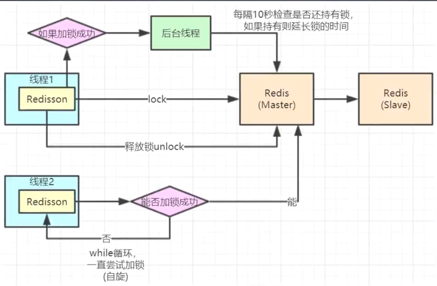

# 减库存案例

## 1. 同步锁
优点： 简单，能解决问题
缺点：仅适合单个服务，多服务进程时失效
## 2. 分布式锁
注意
* 锁持有者归属
* 各个操作锁的地方需要保证原子性
* 需要考虑进程挂掉后锁超时
* 需要考虑锁续命
> Redisson分布式锁使用

```java

        RLock lock = null;

        try {
            lock = redissonClient.getLock(lock_name);
            lock.lock();
            /*
             业务代码
            */
        }  finally {
            if (lock != null) {
                lock.unlock();
            }
        }
```

> Redisson分布式锁原理：


> Redisson底层上锁实际上是执行lua脚本
> 1. 先设置指定锁名，及其对应值 1， （kv结构且值为数值，以方便锁重入）
> 2. 设置超时时间
> ```lua
> -- KEYS[1] 表示锁在redis中的key
> -- ARGV[1] 是超时时间
> -- ARGV[2] 是锁加锁的名字（线程/进程ID）
> if ((redis.call('exists', KEYS[1]) == 0) or (redis.call('hexists', KEYS[1], ARGV[2]) == 1)) then 
>     redis.call('hincrby', KEYS[1], ARGV[2], 1); 
>     redis.call('pexpire', KEYS[1], ARGV[1]); 
>     return nil; 
> end; 
> return redis.call('pttl', KEYS[1]);
> ```

> 3. 获取锁成功后会定时（超时时间 / 3）去刷新超时时间，保持心跳
> ```lua
> -- KEYS[1] 表示锁在redis中的key
> -- ARGV[1] 是超时时间
> -- ARGV[2] 是锁加锁的名字（线程/进程ID）
> if (redis.call('hexists', KEYS[1], ARGV[2]) == 1) then 
>     redis.call('pexpire', KEYS[1], ARGV[1]); 
>     return 1; 
> end; 
> return 0;
> ```

### 问题1：性能问题，上锁导致的性能问题如何尽量优化
> 使用分段锁思路，拆分成多段锁，比如200库存拆分成10个段，每段20个库存，分开上锁
> 使用redis的CAS操作（底层依旧是执行lua脚本实现）替换 读取-修改-保存 这一套操作

### 问题2：Redis集群环境下，主节点挂掉时引发锁丢失问题解决
> 解决方法：
> 1. 使用zookeeper（CP）替换redis（AP）来做分布式锁（使用CP特性）
> 2. Redlock: 使用Redlock解决，实现方式与zookeeper类似（半数以上节点加锁成功才会返回成功）（！但不推荐使用）


## 3. 缓存数据库双写不一致
1. 写库和写缓存之间，其他线程先一步执行完写缓存了，则会导致新数据被覆盖
* 直接改为写库后删除缓存，让其在读取时重新获取
2. 读取时，去获取库中数据并写入缓存期间，被其他写线程先一步写入其他数据，则会导致缓存中的数据并非最新数据
* 延迟双删（不一定100%解决，不太建议，弊端很大）
* 队列化处理（实现偏复杂，且有去重等其他新问题）
* 乐观锁（会导致大量的写失败！！！）
* **使用分布式锁解决**（读写锁，读多写少场景使用）
* **在更新缓存时，设置超时时间**（适合读多写多场景）
* **了解canal**（适合读多写多场景，且一定要使用缓存场景）
