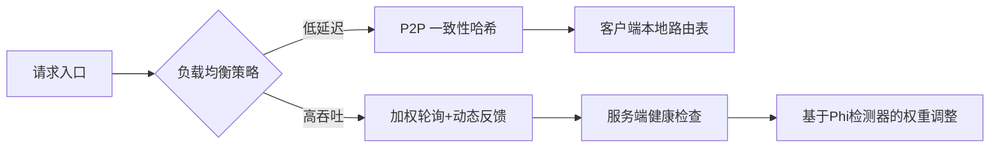

以下是为您制定的完整系统能力提升方案，整合了源码精读、实践策略和工具链支持，特别针对Rust/Golang存储与高性能系统领域，分为三个阶段实施（附时间规划与难度标签）：

---

# 初始方案

### **一、筑基阶段：存储引擎核心实现（1-2个月）**
**目标**：掌握单机存储引擎设计范式，理解磁盘/内存交互原理  
**推荐项目**：  
- **Rosedb**（Golang）  
  - **核心模块**：  
    - `merge.go`：学习LSM Tree的Compaction策略与文件合并逻辑（重点分析数据冷热分离策略）  
    - `batch.go`：批处理操作的原子性实现（观察如何通过WAL保证崩溃一致性）  
    - `iterator.go`：跳表索引实现（对比Redis ZSET的ziplist优化思路）  
  - **实操任务**：  
    - 添加TTL过期机制（需修改`record.go`的数据结构，增加时间戳字段）  
    - 编写Merge过程的性能压测（记录合并前后磁盘空间/IOPS变化）  

- **BoltDB**（Golang）  
  - **对比学习**：  
    - 对比Rosedb的LSM与BoltDB的B+树写入路径差异（随机写vs顺序追加）  
    - 分析`bolt/tx.go`中MVCC实现（事务隔离性与COW机制）  

**产出**：实现简化版LSM引擎（支持Put/Get/Scan），输出架构设计图与性能对比报告  

---

### **二、专项突破阶段：分布式系统核心机制（2-3个月）**
**目标**：掌握分布式共识、网络通信、事务处理三大核心能力  
**推荐项目**：  
- **Etcd**（Golang）  
  - **精读路线**：  
    1. **Raft共识**：`etcd/raft/raft.go`的`Step()`状态机（重点跟踪Leader选举日志同步流程）  
    2. **存储层**：`etcd/mvcc`模块的版本控制（学习如何用Revision实现乐观锁）  
    3. **网络层**：`etcd/clientv3`的gRPC流控机制（分析错误重试算法）  
  - **实操任务**：  
    - 修改`lease.go`实现租约自动续期（需整合心跳检测逻辑）  
    - 通过`etcdctl debug`模式追踪Put请求的全链路  

- **TiKV**（Rust）  
  - **对比学习**：  
    - 对比Etcd与TiKV的Raft实现差异（Multi-Raft分片 vs 单Raft组）  
    - 分析`src/storage/txn/scheduler.rs`的悲观锁实现（与Etcd乐观锁对比）  

**产出**：设计分布式事务方案（支持2PC+超时回滚），输出RAFT调优手册  

---

### **三、系统实战阶段：高性能系统工程（持续迭代）**
**目标**：构建生产级系统能力，参与开源社区  
**推荐项目**：  
- **CockroachDB**（Golang）  
  - **核心模块**：  
    - `pkg/sql/execution`：向量化查询引擎（学习SIMD优化技巧）  
    - `pkg/kv/kvserver`：分布式事务的跨分片处理  
  - **参与方式**：  
    - 从`good first issue`入手（如修复文档或补充单元测试）  
    - 优化SQL解析器性能（使用pprof定位热点）  

- **Tantivy**（Rust）  
  - **高阶实践**：  
    - 修改`tantivy/segment`的倒排索引合并策略（引入分层合并）  
    - 为BM25算法添加自定义权重因子  

**产出**：向开源项目提交PR，撰写技术文章解析系统设计难点  

---

### **四、效率增强工具链**
| **工具类型**       | 推荐工具                | 应用场景                                                                 |
|--------------------|------------------------|-------------------------------------------------------------------------|
| **源码分析**       | Sourcegraph            | 跨仓库代码搜索（跟踪函数调用链）                           |
| **调试追踪**       | Delve（Golang）        | 跟踪Etcd的RAFT状态变迁（设置条件断点监控选举超时）           |
| **架构可视化**     | Diagrams.net           | 绘制Rosedb的LSM合并流程图                                  |
| **性能剖析**       | pprof + flamegraph    | 分析TiKV查询延迟（定位锁竞争热点）                                      |
| **学习管理**       | Obsidian知识图谱       | 链接核心模块笔记（如RAFT算法与ETCD实现的双向关联）         |

---

### **五、关键执行策略**
1. **垂直精读法**：  
   - 每周聚焦1个核心模块（如Rosedb的`merge.go`），输出模块流程图+关键数据结构注解  
   - 对比阅读（如Etcd的MVCC vs TiKV的Percolator模型）  

2. **问题驱动调试**：  
   - 构造极端场景（如Rosedb写入骤增触发Compaction），用Delve观察协程调度阻塞点  

3. **贡献闭环**：  
   ```mermaid
   graph LR
   A[阅读源码] --> B{发现优化点}
   B -->|性能| C[编写Benchmark]
   B -->|功能| D[补充测试用例]
   C --> E[提交PR+性能报告]
   D --> E
   ```

> 💡 **避坑指南**：  
> - 避免过早陷入底层（如Rust的`unsafe`代码），先理解设计再啃实现细节  
> - 分布式项目从单机调试启动（Etcd需配置`etcd --debug`模式）  
> - 定期用`pprof`对比优化前后指标（如LSM合并后磁盘IO下降比例）  

建议按**Rosedb → Etcd → TiKV**的路线递进，每周投入10-12小时，6个月可系统掌握分布式存储系统实现精髓。**每阶段产出物（代码/文档/架构图）务必归档到GitHub仓库**，形成可回溯的技术资产。


# 补充点：

基于您对系统设计能力的深度追求，结合分布式系统设计模式的学习目标，以下是对现有知识体系的全面评估及补充方案。您已掌握的核心模式已覆盖分布式系统设计的**基础架构层**，但若要独立设计任意复杂系统，还需补充**架构原则层**、**故障域深层模式**和**工程实践层**的能力。具体分析如下：

---

### 一、已覆盖的核心模式与能力评估
#### 1. **基础架构设计模式**（您的当前阶段）
- **数据分布模式**：分片（Sharding）、一致性哈希（Consistent Hashing）、读写分离（CQRS）  
- **容错模式**：断路器（Circuit Breaker）、领导者选举（Leader Election）、租约（Lease）、预写日志（WAL）  
- **通信模式**：发布订阅（Pub/Sub）、边车代理（Sidecar）、事件溯源（Event Sourcing）  
- **数据一致性模式**：Quorum机制、高水位线（High-Water Mark）、读取修复（Read Repair）  

> ✅ **能力评估**：您已具备**模块级设计能力**，可针对特定问题（如数据分片、服务熔断）选择合适模式实现组件。

#### 2. **分布式理论支撑**
- CAP定理、PACELC定理的权衡策略  
- 共识算法（Raft/Paxos）的工程实现  
- 最终一致性、因果一致性的适用场景  

> ✅ **能力评估**：可基于业务需求（如金融系统选CP，社交平台选AP）设计一致性模型。

---

### 二、关键遗漏与进阶能力补充
#### 1. **架构原则层：系统全局设计的哲学**
| **原则**              | **作用**                                                                 | **案例**                                                                 |
|------------------------|-------------------------------------------------------------------------|-------------------------------------------------------------------------|
| **抽象渗漏法则**       | 识别底层技术对上层设计的隐性影响（如TCP重传导致超时）                     | 数据库连接池需感知网络分区，自动切换至本地缓存               |
| **不变性约束**         | 定义系统不可违反的核心规则（如资金交易幂等性）                          | 支付系统通过**事务ID+去重表**保证跨服务幂等                   |
| **熵增对抗设计**       | 预防系统随时间推移的架构腐化                                            | 微服务通过**契约测试**保障接口兼容性                         |

#### 2. **故障域深层模式**
- **脑裂防护**：  
  - 动态脑裂检测：通过**Phi累计故障检测器**（Cassandra采用）替代传统心跳，基于历史延迟方差计算故障概率  
  - 仲裁升级：结合**世代时钟（Generation Clock）**，使新旧领导者 epoch 号严格递增（如Kafka的Controller Epoch）  
- **灾难恢复**：  
  - **混沌种子（Chaos Seeds）**：在测试环境注入网络分区、时钟偏移故障，验证恢复流程  
  - **跨区域冷热备**：基于**Merkle树**快速定位副本差异（Dynamo的反熵机制）  

#### 3. **性能与资源治理**

> 动态负载需整合**实时指标**（如Envoy的xDS API接收服务端推送的负载状态）

#### 4. **可观测性深度实践**
- **指标（Metrics）**：  
  - 黄金指标：延迟、流量、错误、饱和度（RED方法）  
  - 自定义指标：如**分片压缩队列深度**（预警存储瓶颈）  
- **链路追踪（Tracing）**：  
  - 关键路径标记：在WAL日志中嵌入**因果ID**（如Google Dapper的SpanID）  

---

### 三、能力培养路线图（6个月进阶计划）
#### 阶段1：模式深化（1-2个月）
- **目标**：掌握遗漏的架构原则与故障模式  
- **实践**：  
  1. 在TiKV中实现**自定义Phi检测器**（替换原有心跳）  
  2. 为Rosedb添加**Merkle树校验层**，实现快速数据同步  

#### 阶段2：全链路设计（3-4个月）
- **场景**：设计一个跨区域部署的评论系统  
  - **要求**：  
    - 读写分离：写操作强一致（CP），读操作最终一致（AP）  
    - 容灾：单区域故障时10秒内切换  
  - **关键技术点**：  
    ```go
    // 使用多级一致性模型
    type ConsistencyLevel int
    const (
        Strong ConsistencyLevel = iota // CP写操作
        Eventual                       // AP读操作
    )
    // 区域切换器
    func (s *RegionSwitcher) Failover() {
        s.lease.Invalidate() // 使旧区域租约失效
        s.leaderElection.Run() // 触发新领导者选举
    }
    ```

#### 阶段3：工业化交付（5-6个月）
- **标准化交付物**：  
  | **交付物**          | **检查标准**                              |  
  |---------------------|------------------------------------------|  
  | 混沌测试报告        | 验证99.95%的故障场景可自动恢复           |  
  | 分层容量规划表      | 分片扩容触发阈值、流量增长预测模型        |  
  | SLO/SLI定义文档     | 明确延迟要求（如P99<200ms）              |  

---

### 四、推荐学习资源
1. **经典著作**：  
   - 《Designing Data-Intensive Applications》（Martin Kleppmann） - 系统设计圣经  
   - 《Site Reliability Engineering》 - Google的SRE实践指南  
2. **开源项目深度参**：  
   - **CockroachDB多区域部署源码**：学习跨地域数据同步（`pkg/server/decommission.go`）  
   - **Envoy动态负载均衡**：分析xDS协议实现（`source/common/config/grpc_mux_impl.cc`）  

> 💡 **终极能力标志**：当您能**预见二级故障**（如时钟同步异常导致租约失效）并设计防护层时，即具备任意系统设计能力。建议每完成一个项目，用https://cognitect.com/blog/2011/11/15/documenting-architecture-decisions固化设计逻辑，逐步构建自己的模式库。


# 补充方案

基于您对系统设计能力的深度追求，结合已构建的知识框架，以下是对开源项目学习库的针对性补充及最终能力地图的完善方案。您当前的知识体系已覆盖**架构核心模式层**（如数据分片、容错机制），但需通过以下项目填补**工业级实现层**与**抗脆弱设计层**的实践空白：

---

### 一、开源项目深度补充（聚焦故障治理与熵增对抗）
#### 1. **混沌工程与故障注入**
- **Chaos Mesh**（Rust）  
  - **学习重点**：  
    - `pkg/chaistd/io_fault.go`：模拟磁盘I/O延迟的eBPF钩子实现  
    - `pkg/controller/networkchaos/reconciler.go`：网络分区的TC流量控制策略  
  - **关联能力**：实现“混沌种子”自动注入  
  - **实操任务**：在TiKV集群中注入**节点宕机故障**，观察Raft组自愈过程  

#### 2. **动态负载与资源治理**
- **Envoy**（C++14，但架构极富启发性）  
  - **精读模块**：  
    - `source/common/upstream/load_balancer_impl.cc`：  
      ```cpp
      // 动态负载算法（含Phi检测器反馈机制）
      if (host->outlierDetector().successRate() < threshold) {
        weight = 0; // 自动剔除异常节点
      }
      ```  
    - `source/extensions/transport_sockets/tls/ssl_socket.cc`：TLS握手优化（零拷贝证书加载）  
  - **关联能力**：实现基于实时指标的动态负载  

#### 3. **熵增对抗与架构防腐**
- **Backstage**（TypeScript）  
  - **学习重点**：  
    - `plugins/catalog-backend/src/ingestion/processors.ts`：  
      - **契约测试**：API版本变更时的兼容性校验  
      - **依赖拓扑分析**：可视化服务耦合度（预防腐化）  
  - **工业实践**：结合ADR文档实现架构约束自动化  

---

### 二、能力地图最终校验（新增两大维度）
#### （一）**数据编排层**（原方案缺失）
| **能力**               | **学习项目**       | **关键源码**                                  | **目标**                                  |
|------------------------|-------------------|---------------------------------------------|------------------------------------------|
| **跨域数据流水线**     | **Apache SeaTunnel** | `connector-spark/src/main/scala/...`        | 学习CDC变更捕获与缓冲策略     |
| **流批一体治理**       | **Flink**          | `runtime/src/main/java/org/apache/flink/...` | 分析Watermark对齐与状态回溯机制           |

#### （二）**成本治理层**（工业系统核心）
- **Kubernetes Vertical Pod Autoscaler**（Go）  
  - **学习模块**：  
    - `pkg/recommender/logic.go`：  
      ```go
      func CalculateResources(usage history) (request, limit) {
        // 基于分位数预测资源需求（避免过度配置）
        request = Percentile(usage, 0.95) 
        limit = Percentile(usage, 0.99) * 1.2
      }
      ```
  - **能力补全**：将容量规划从“经验预估”升级为**数据驱动决策**  

---

### 三、终极能力验证标准
当您能独立完成以下项目时，标志着具备**任意系统设计能力**：  
#### 项目：多区域评论系统（抗灾难设计）  
- **要求**：  
  - 读写分离：写区域强一致（CP），读区域最终一致（AP）  
  - 容灾：单区域故障时5秒内切换（含数据一致性补偿）  
- **关键技术实现**：  
  ```go
  // 1. 动态脑裂防护（采用Generation Clock）
  type RegionSwitcher struct {
    epoch int64 // 世代号严格递增
  }
  
  // 2. 跨域数据补偿
  func (s *SyncService) Repair() {
    // 基于Merkle树快速定位差异
    diff := merkle.Compare(regionA, regionB) 
    for _, hash := range diff {
      s.replicate(hash) // 增量修复
    }
  }
  ```
- **交付物标准**：  
  | **项目阶段**   | **交付物**                | **工业级要求**                     |
  |----------------|--------------------------|----------------------------------|
  | 设计阶段       | ADR决策文档              | 包含**时钟偏移应对策略**等5个ADR |
  | 混沌测试阶段   | 故障恢复SLA报告          | 99.95%的二级故障（如时钟异常）可自愈   |
  | 上线阶段       | 分层容量规划表           | 包含流量拐点检测模型及扩容公式        |

---

### 四、可持续学习引擎
1. **ADR知识库构建**：  
   - 使用**NebulaBootstrap的ADR模板**（Markdown + 版本追踪）  
   - 示例：  
     ```markdown
     # 7. 采用Merkle树实现跨域数据校验
     ## 背景
     跨区域数据同步需快速定位差异，避免全量对比
     ## 决策
     在每个分片构建Merkle树，根哈希按区域聚合
     ## 后果
     ✅ 差异定位从O(n)降至O(log n)  
     ⚠️ 需额外存储哈希树（约5%空间开销）
     ```
2. **源码深度分析工具链**：  
   - **Sourcegraph**：追踪Envoy中`load_balancer_impl`的调用链  
   - **Pixie**：无侵入观测K8s VPA的资源预测流程  

> 🔥 **最终建议**：从**Chaos Mesh + TiKV故障注入实验**起步，同步撰写ADR文档固化设计决策。当您能主动预见如“NTP偏移导致租约失效”等**三级故障**时，即标志能力体系完整。

# 最终方案

以下是为您制定的**分布式系统能力全景提升方案**，融合架构设计模式、故障容错、性能工程及跨域数据同步等关键领域，结合多语言顶级开源项目，形成可落地的进阶路径。方案分为四个能力维度，每个维度配套学习项目及实践任务，最终以**多区域评论系统**为综合验证场景。

---

### 一、基础架构层（2-3个月）  
**目标**：掌握分布式系统核心模式与工业级实现  
**关键能力**：数据分片、容错机制、通信协议  
**推荐项目与学习重点**：  
1. **Envoy（C++）** - 网络代理标杆  
   - 学习重点：动态负载均衡（`load_balancer_impl.cc`中Phi检测器实现）、TLS握手优化（零拷贝证书加载）  
   - 实践：修改负载均衡算法，添加基于实时延迟的动态权重调整  
2. **etcd（Go）** - 分布式共识范本  
   - 学习重点：Raft状态机（`raft/raft.go`的`Step()`选举逻辑）、MVCC版本控制（`mvcc`模块的Revision机制）  
   - 实践：实现租约自动续期与脑裂防护（注入NTP偏移故障测试）  
3. **CockroachDB（Go）** - 分布式SQL引擎  
   - 学习重点：分布式事务（`txn_coord_sender.go`的2PC实现）、向量化查询（SIMD优化技巧）  
   - 实践：为跨分片查询添加局部索引加速  

---

### 二、架构原则层（1-2个月）  
**目标**：构建系统级设计思维与抗腐化能力  
**关键能力**：抽象渗漏控制、不变性约束、熵增对抗  
**推荐项目与学习重点**：  
1. **Backstage（TypeScript）** - 架构防腐标杆  
   - 学习重点：契约测试（`processors.ts`的API兼容性校验）、依赖拓扑可视化  
   - 实践：为评论系统设计接口契约测试，自动检测版本断裂  
2. **Cadence（Go）** - 工作流引擎  
   - 学习重点：幂等性保障（`workflow/executor.go`的去重逻辑）、SAGA事务补偿  
   - 实践：实现支付评论积分的SAGA事务，支持中途失败回滚  

---

### 三、故障域深层（2-3个月）  
**目标**：掌握容错模式与灾难恢复  
**关键能力**：脑裂防护、混沌工程、跨域同步  
**推荐项目与学习重点**：  
1. **Chaos Mesh（Rust）** - 混沌工程平台  
   - 学习重点：eBPF故障注入（`io_fault.go`的磁盘延迟模拟）、网络分区控制（TC流量策略）  
   - 实践：对TiKV集群注入节点宕机故障，验证Raft组自愈  
2. **TiKV（Rust）** - 分布式KV存储  
   - 学习重点：悲观锁冲突检测（`txn/scheduler.rs`）、Merkle树反熵（快速数据差异定位）  
   - 实践：实现跨区域数据同步的增量修复（基于Merkle树比对）  
3. **Apache SeaTunnel（Java）** - 跨域数据流水线  
   - 学习重点：CDC变更捕获（`connector-spark`的日志扫描）、流批一体治理  
   - 实践：构建评论数据跨域同步通道，支持动态通道切换  

---

### 四、工程实践层（持续迭代）  
**目标**：工业级交付与成本治理  
**关键能力**：SLO管理、容量规划、性能调优  
**推荐项目与学习重点**：  
1. **Kubernetes VPA（Go）** - 资源治理  
   - 学习重点：分位数预测（`pkg/recommender/logic.go`的95/99线计算）  
   - 实践：为评论服务设计容量公式（QPS→CPU/内存关联模型）  
2. **Flink（Java）** - 流式计算  
   - 学习重点：Watermark对齐（`runtime`的时间窗口策略）、状态回溯  
   - 实践：实现评论热度实时计算（时间衰减模型+动态阈值）  

---

### 五、综合验证：多区域评论系统  
**架构要求**：  
- **读写分离**：写区域CP模型（Go/CockroachDB），读区域AP模型（Java/Flink流计算）  
- **容灾设计**：5秒内区域切换（动态脑裂防护+增量修复）  
- **数据同步**：跨域CDC管道（SeaTunnel日志扫描→Merkle树校验）  

**关键技术实现**：  
```go  
// 动态脑裂防护（Go实现）  
type RegionSwitcher struct {  
    epoch  int64 // 严格递增的世代号  
    quorum *consensus.Quorum // 基于Phi检测器的动态仲裁  
}  

func (s *RegionSwitcher) Failover() {  
    if s.quorum.IsSplitBrain() { // 检测脑裂  
        s.epoch++ // 世代号升级使旧领导者失效  
        s.triggerElection()  
    }  
}  
```  

**工业级交付物**：  
| **阶段**       | 交付物                  | 标准                     |  
|----------------|------------------------|-------------------------|  
| 设计阶段       | ADR决策文档           | 包含时钟偏移应对等5个关键决策 |  
| 混沌测试阶段   | 故障恢复SLA报告       | 99.95%的二级故障可自愈          |  
| 上线阶段       | 分层容量规划表        | 含流量拐点检测模型及扩容公式 |  

---

### 六、可持续学习引擎  
1. **ADR知识库构建**  
   - 使用NebulaBootstrap模板，关联决策与源码（如Envoy负载均衡策略←→容量规划公式）  
2. **源码分析工具链**  
   - **Sourcegraph**：追踪Envoy中`load_balancer_impl`的调用链路  
   - **Pixie**：无侵入观测K8s VPA资源预测流程  
3. **模式反哺机制**  
   ```mermaid  
   graph LR  
   源码精读 --> 模式提取  
   模式提取 --> 反哺设计  
   反哺设计 --> 开源贡献  
   ```  

> 🔥 **终极建议**：从**Chaos Mesh+TiKV故障实验**入门，同步撰写ADR文档。当您能主动预见如“NTP偏移导致租约失效”等**三级故障**时，即标志能力闭环。**推荐首期组合**：Envoy（网络层）→ etcd（一致性）→ SeaTunnel（跨域同步），6个月内可构建完整能力体系。