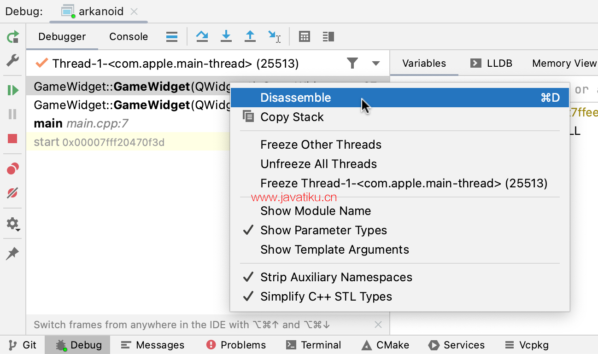

## foreach需注意的细节

```rust
let arr = [1,2,3,4];
for i in arr {
	// ...
}
for i in &arr {
	// ...
}
```
* 前者底层会调用into_iter(self) 会导致数组复制，可能产生意料之外的损耗

## let 模式匹配获取值，解决 if let 会导致新增嵌套层的问题
```rust
let Data::Struct(s) = ast.data else{
    panic!("MyDefault derive macro must use in struct");
};

let Some(s) = data else {
    panic!("not data");
}
println!("{s}");
```

## 断点调试时

### LLDB和GDB看汇编源码
disassemble 命令
```lldb
(lldb) disassemble
# 指定一个特定的地址或函数来查看
(lldb) disassemble -f <函数名>
(lldb) disassemble <地址>
```

### Clion、RustCover 打开返汇编视图


## 延长生命周期

1. Box::leak
2. 变形记(Transmutes) 参考：Rust - 进阶 - 类型转换 - 变形记(Transmutes)

## #[derive(PartialEq)]
编译器默认实现类似以下代码:
```rust
impl PartialEq for Person {
    fn eq(&self, other: &Self) -> bool {
        self.id == other.id &&
            self.name == other.name &&
            self.height == other.height
    }
}
```

